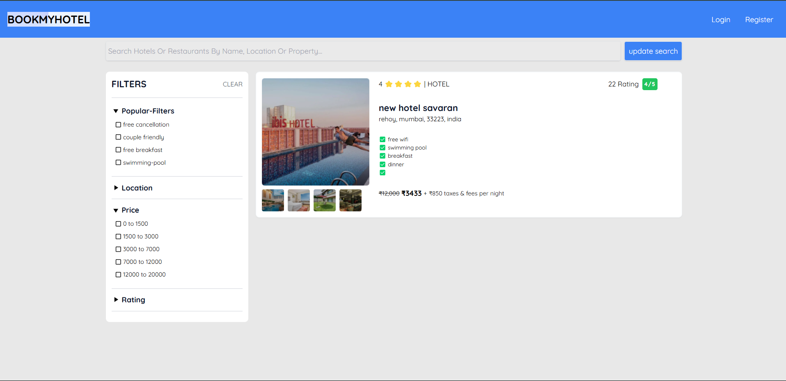

# BOOKMYHOTEL

## About

A full-stack hotel and restaurant booking platform built with React.js, RTK Query, and Node.js. Implements role-based authentication using JWT and manages data with PostgreSQL and Prisma ORM. Supports Admin, Vendor, and Customer roles with secure access control. Designed for scalability and optimized performance.

## Tech Stack

Front-End

- React.js
- Redux Toolkit, RTK Query
- React-Hook-Form
- Tailwind CSS
- React-Icons

Back-End (Monolithic architecture)

- Node.js, Express.js
- PostgreSQL, PrismaORM
- JsonWebTokens(JWT)
- Cloudinary (image storage)
- Morgan
- Multiparty (multi-part form data parser)

## Features

- Book Hotels and Restaurants
- Support Vendor services and Admin control
- Secure user Authentication and Authorization
- Search and Filter Hotels and Restaurants by name, price, location, rating etc.
- Fully Responsive and Reusable components designing
